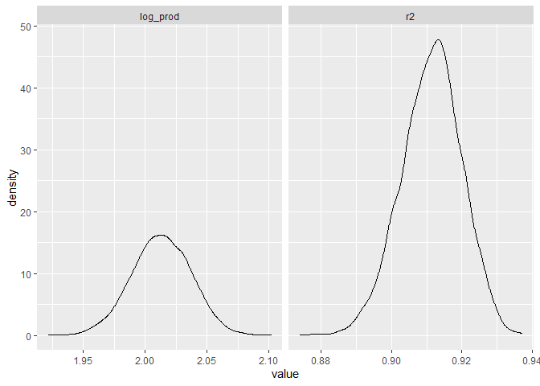
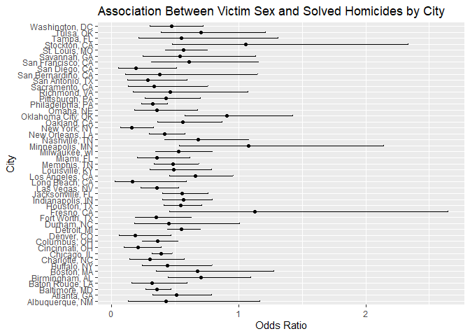
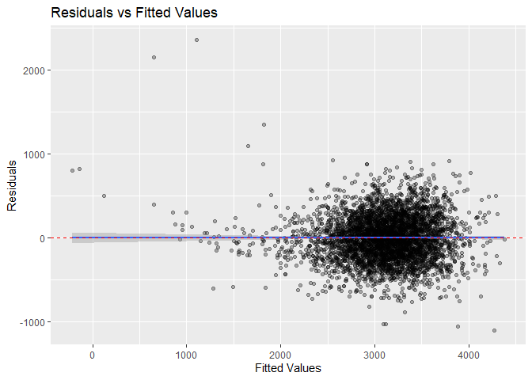
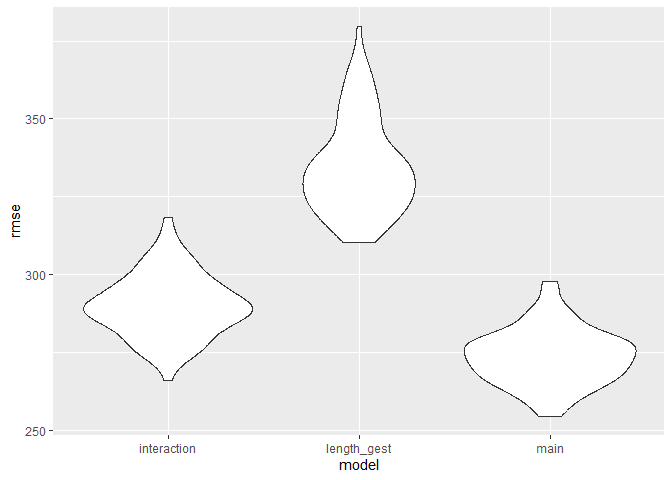

p8105_hw6_ns3782
================
NSK
2024-11-23

# Problem 1: Bootstrapping

``` r
# Load weather data

weather_df = 
  rnoaa::meteo_pull_monitors(
    c("USW00094728"),
    var = c("PRCP", "TMIN", "TMAX"), 
    date_min = "2017-01-01",
    date_max = "2017-12-31") %>%
  mutate(
    name = recode(id, USW00094728 = "CentralPark_NY"),
    tmin = tmin / 10,
    tmax = tmax / 10) %>%
  select(name, id, everything())
```

    ## using cached file: C:\Users\naomi\AppData\Local/R/cache/R/rnoaa/noaa_ghcnd/USW00094728.dly

    ## date created (size, mb): 2024-12-01 18:17:02.009933 (8.685)

    ## file min/max dates: 1869-01-01 / 2024-11-30

``` r
# Set seed for reproducibility

set.seed(1)

# Obtain R squared values and log product of coefficient estimates from each bootstrap sample

bootstrap_results = 
  weather_df %>%
  modelr::bootstrap(n = 5000) %>%
  mutate(
    models = map(strap, \(df) lm(tmax ~ tmin, data = df)),
    r2 = map_dbl(models, \(model) glance(model)$r.squared),
    results = map(models, broom::tidy)) %>%
  unnest(results) %>%
  select(.id, term, estimate, r2) %>%
  pivot_wider(
    names_from = term,
    values_from = estimate
  ) %>%
  mutate(
    log_prod = log(`(Intercept)` * tmin)
  ) %>%
  select(r2, log_prod)

# Visualisations of estimates

bootstrap_results %>%
  pivot_longer(
    everything(),
    names_to = "statistic", 
    values_to = "value"
  ) %>%
  ggplot(aes(x = value)) +
  geom_density() +
  facet_grid(~statistic, scales = "free")
```

<!-- -->

Based on the plot, the R-squared values peak around 0.92, which
indicates a consistently strong relationship between minimum and maximum
temperatures across the bootstrap samples. The distribution has a narrow
range from about 0.88 to 0.94, indicating that across bootstrap samples,
the model consistently explains a high proportion of the variance in
maximum temperatures using minimum temperatures as a predictor. Since
R-squared is bounded between 0 and 1 (as it represents the proportion of
variance explained by the model), the range of values being closer to 1
indicates the model fits the data very well.

The log product of coefficients peaks around 2.0, with values ranging
approximately from 1.95 to 2.10. The distribution of both estimates is
bell-shaped/approximately normal, which is typical of repeated sampling.
The relatively narrow, symmetric spreads indicates that these estimates
are stable across bootstrap samples. This stability suggests that if new
weather data were collected, we would likely find similar values for
both the model fit and coefficient relationship.

The observed difference in distributions represents differences in the
properties of the estimates obtained from bootstrapping: R-squared
values must fall between 0 and 1 as they represent a proportion of
explained variance, while the log product can exceed these bounds.
Overall, this analysis shows the value of bootstrapping in understanding
the sampling variability of model estimates, especially for quantities
like the log product of coefficients where the theoretical sampling
distribution isn’t readily available.

## 95% confidence interval for bootstrapping estimates

``` r
# Create confidence interval table for estimates

bootstrap_results %>%
  summarise(
    R2 = sprintf("[%.3f, %.3f]", quantile(r2, 0.025), quantile(r2, 0.975)),
    logprod = sprintf("[%.3f, %.3f]", quantile(log_prod, 0.025), quantile(log_prod, 0.975))
  ) %>%
  pivot_longer(everything(), 
               names_to = "Estimate",
               values_to = "95% Confidence Interval") %>%
  mutate(Estimate = case_when(
    Estimate == "R2" ~ "R²",
    Estimate == "logprod" ~ "log(β₀*β₁)"
  )) %>%
  knitr::kable()
```

| Estimate    | 95% Confidence Interval |
|:------------|:------------------------|
| R²          | \[0.894, 0.927\]        |
| log(β₀\*β₁) | \[1.965, 2.059\]        |

# Problem 2: U.S. City Homicides

``` r
# Load and clean homicide data

homicide_data <- 
  read_csv("homicide-data.csv") %>%
  mutate(
    city_state = paste(city, state, sep = ", "),
    solved = case_when(
      disposition == "Closed by arrest" ~ 1,
      disposition == "Closed without arrest" ~ 1,
      disposition == "Open/No arrest" ~ 0
    ),
    victim_age = as.numeric(victim_age)
  ) %>%
  filter(
    !(city_state %in% c("Dallas, TX", "Phoenix, AZ", "Kansas City, MO", "Tulsa, AL")),
    victim_race %in% c("White", "Black")
  )
```

    ## Rows: 52179 Columns: 12
    ## ── Column specification ────────────────────────────────────────────────────────
    ## Delimiter: ","
    ## chr (9): uid, victim_last, victim_first, victim_race, victim_age, victim_sex...
    ## dbl (3): reported_date, lat, lon
    ## 
    ## ℹ Use `spec()` to retrieve the full column specification for this data.
    ## ℹ Specify the column types or set `show_col_types = FALSE` to quiet this message.

    ## Warning: There was 1 warning in `mutate()`.
    ## ℹ In argument: `victim_age = as.numeric(victim_age)`.
    ## Caused by warning:
    ## ! NAs introduced by coercion

## Adjusted odds ratios for solved homicides by victim sex in Baltimore, MD

``` r
# Create new dataset filtering for Baltimore

baltimore_df <- 
  homicide_data %>%
  filter(city_state == "Baltimore, MD")

# Fit logistic regression

baltimore_solved_logistic <- 
  baltimore_df %>%
  glm(solved ~ victim_age + victim_race + victim_sex, 
      data = ., 
      family = binomial())

# Model results with estimate and confidence interval

baltimore_solved_logistic %>%
  broom::tidy(conf.int = TRUE) %>%
  mutate(
    OR = exp(estimate),
    OR_lower = exp(conf.low),
    OR_upper = exp(conf.high)
  ) %>%
  select(term, log_OR = estimate, OR, OR_lower, OR_upper, p.value) %>%
  knitr::kable(digits = 3)
```

| term             | log_OR |    OR | OR_lower | OR_upper | p.value |
|:-----------------|-------:|------:|---------:|---------:|--------:|
| (Intercept)      |  0.664 | 1.942 |    1.383 |    2.744 |    0.00 |
| victim_age       | -0.005 | 0.995 |    0.988 |    1.001 |    0.11 |
| victim_raceWhite |  0.900 | 2.459 |    1.733 |    3.519 |    0.00 |
| victim_sexMale   | -1.037 | 0.355 |    0.267 |    0.468 |    0.00 |

Based on the logistic regression analysis of Baltimore homicides, the
odds of solving a case are 0.35 times lower for male victims compared to
female victims (OR = 0.35, 95% CI: 0.27, 0.47), after adjusting for
victim age and race.

## Adjusted odds ratios for solved homicides by victim sex in 47 U.S. cities

``` r
city_results <- homicide_data %>%
  group_by(city_state) %>%           
  nest() %>%                         
  mutate(
    results = map(data, ~glm(solved ~ victim_age + victim_race + victim_sex, 
                            data = ., family = binomial()) %>%
                    broom::tidy(conf.int = TRUE) %>%
                    filter(term == "victim_sexMale"))
  ) %>%
  unnest(results) %>%
  mutate(
    OR = exp(estimate),
    OR_lower = exp(conf.low),
    OR_upper = exp(conf.high)
  ) %>%
  select(city_state, OR, OR_lower, OR_upper, p.value)
```

    ## Warning: There were 44 warnings in `mutate()`.
    ## The first warning was:
    ## ℹ In argument: `results = map(...)`.
    ## ℹ In group 1: `city_state = "Albuquerque, NM"`.
    ## Caused by warning:
    ## ! glm.fit: fitted probabilities numerically 0 or 1 occurred
    ## ℹ Run `dplyr::last_dplyr_warnings()` to see the 43 remaining warnings.

``` r
city_results %>%
  mutate(city_state = fct_reorder(city_state, OR)) %>%
  ggplot(aes(x = OR, y = city_state)) +
  geom_point() +
  geom_errorbarh(aes(xmin = OR_lower, xmax = OR_upper), height = 0.2) +
  labs(title = "Association Between Victim Sex and Solved Homicides by City",
       x = "Odds Ratio", 
       y = "City") 
```

<!-- -->

Based on the plot, in most cities cases with male homicide victims
appear to have lower odds of being solved, compared to cases with female
homicide victims. This is because most of the odds ratios observed are
less than 1. Of these cities, San Bernandino, Albuquerque, Durham,
Richmond, Savannah, Tampa, San Francisco, Boston, Nashville, Tulsa,
Birmingham and Oklahoma have confidence intervals that cross 1,
indicating that for these cities, the odds ratio difference between male
and female victims is not statistically significant.

Only Stockton, Minneapolis, Fresno have odds ratios greater than 1,
however they are not significant based on the confidence intervals
observed which include 1.

# Problem 3: Children’s Birthweight

``` r
# Load data and clean variables

birthweight <- 
  read_csv("birthweight.csv") %>%
  mutate(
    babysex = factor(babysex, levels = c(1, 2), labels = c("Male", "Female")),
    malform = factor(malform, levels = c(0, 1), labels = c("Absent", "Present")),
    frace = factor(frace, 
                  levels = c(1, 2, 3, 4, 8, 9),
                  labels = c("White", "Black", "Asian", "Puerto Rican", "Other", "Unknown")),
    mrace = factor(mrace,
                  levels = c(1, 2, 3, 4, 8),
                  labels = c("White", "Black", "Asian", "Puerto Rican", "Other"))
  )
```

    ## Rows: 4342 Columns: 20
    ## ── Column specification ────────────────────────────────────────────────────────
    ## Delimiter: ","
    ## dbl (20): babysex, bhead, blength, bwt, delwt, fincome, frace, gaweeks, malf...
    ## 
    ## ℹ Use `spec()` to retrieve the full column specification for this data.
    ## ℹ Specify the column types or set `show_col_types = FALSE` to quiet this message.

``` r
# Check for missing values

colSums(is.na(birthweight))
```

    ##  babysex    bhead  blength      bwt    delwt  fincome    frace  gaweeks 
    ##        0        0        0        0        0        0        0        0 
    ##  malform menarche  mheight   momage    mrace   parity  pnumlbw  pnumsga 
    ##        0        0        0        0        0        0        0        0 
    ##    ppbmi     ppwt   smoken   wtgain 
    ##        0        0        0        0

## Backwards Selection: Regression model for birthweight

Following data cleaning, I proceeded with backwards selection to produce
an appropriate regression model for birthweight.

``` r
# Full model: including all variables in birthweight dataset

full_model <- lm(bwt ~ babysex + bhead + blength + delwt + fincome + 
                   frace + gaweeks + menarche + mheight + momage + 
                   mrace + parity + ppwt + smoken + wtgain, 
                 data = birthweight)

# Simple backwards selection

final_model <- step(full_model)
```

    ## Start:  AIC=48713.93
    ## bwt ~ babysex + bhead + blength + delwt + fincome + frace + gaweeks + 
    ##     menarche + mheight + momage + mrace + parity + ppwt + smoken + 
    ##     wtgain
    ## 
    ## 
    ## Step:  AIC=48713.93
    ## bwt ~ babysex + bhead + blength + delwt + fincome + frace + gaweeks + 
    ##     menarche + mheight + momage + mrace + parity + ppwt + smoken
    ## 
    ##            Df Sum of Sq       RSS   AIC
    ## - frace     4    125020 320857079 48708
    ## - momage    1     29488 320761547 48712
    ## - menarche  1    113491 320845550 48713
    ## <none>                  320732060 48714
    ## - fincome   1    194226 320926285 48715
    ## - parity    1    411953 321144013 48718
    ## - mrace     3    870936 321602996 48720
    ## - babysex   1    851752 321583812 48723
    ## - mheight   1   1063721 321795781 48726
    ## - ppwt      1   2932419 323664478 48751
    ## - gaweeks   1   4608225 325340284 48774
    ## - smoken    1   5079579 325811639 48780
    ## - delwt     1   8021018 328753078 48819
    ## - blength   1 102074356 422806415 49912
    ## - bhead     1 106689617 427421677 49959
    ## 
    ## Step:  AIC=48707.63
    ## bwt ~ babysex + bhead + blength + delwt + fincome + gaweeks + 
    ##     menarche + mheight + momage + mrace + parity + ppwt + smoken
    ## 
    ##            Df Sum of Sq       RSS   AIC
    ## - momage    1     29211 320886290 48706
    ## - menarche  1    117635 320974714 48707
    ## <none>                  320857079 48708
    ## - fincome   1    195199 321052278 48708
    ## - parity    1    412984 321270064 48711
    ## - babysex   1    850020 321707099 48717
    ## - mheight   1   1078673 321935752 48720
    ## - ppwt      1   2934023 323791103 48745
    ## - gaweeks   1   4621504 325478583 48768
    ## - smoken    1   5039368 325896447 48773
    ## - delwt     1   8024939 328882018 48813
    ## - mrace     3  13551444 334408523 48881
    ## - blength   1 102018559 422875638 49904
    ## - bhead     1 106821342 427678421 49953
    ## 
    ## Step:  AIC=48706.02
    ## bwt ~ babysex + bhead + blength + delwt + fincome + gaweeks + 
    ##     menarche + mheight + mrace + parity + ppwt + smoken
    ## 
    ##            Df Sum of Sq       RSS   AIC
    ## - menarche  1    100121 320986412 48705
    ## <none>                  320886290 48706
    ## - fincome   1    240800 321127090 48707
    ## - parity    1    431433 321317724 48710
    ## - babysex   1    841278 321727568 48715
    ## - mheight   1   1076739 321963029 48719
    ## - ppwt      1   2913653 323799943 48743
    ## - gaweeks   1   4676469 325562760 48767
    ## - smoken    1   5045104 325931394 48772
    ## - delwt     1   8000672 328886962 48811
    ## - mrace     3  14667730 335554021 48894
    ## - blength   1 101990556 422876847 49902
    ## - bhead     1 106864308 427750598 49952
    ## 
    ## Step:  AIC=48705.38
    ## bwt ~ babysex + bhead + blength + delwt + fincome + gaweeks + 
    ##     mheight + mrace + parity + ppwt + smoken
    ## 
    ##           Df Sum of Sq       RSS   AIC
    ## <none>                 320986412 48705
    ## - fincome  1    245637 321232048 48707
    ## - parity   1    422770 321409181 48709
    ## - babysex  1    846134 321832545 48715
    ## - mheight  1   1012240 321998651 48717
    ## - ppwt     1   2907049 323893461 48743
    ## - gaweeks  1   4662501 325648912 48766
    ## - smoken   1   5073849 326060260 48771
    ## - delwt    1   8137459 329123871 48812
    ## - mrace    3  14683609 335670021 48894
    ## - blength  1 102191779 423178191 49903
    ## - bhead    1 106779754 427766166 49950

``` r
# Results of backwards selection

summary(final_model)
```

    ## 
    ## Call:
    ## lm(formula = bwt ~ babysex + bhead + blength + delwt + fincome + 
    ##     gaweeks + mheight + mrace + parity + ppwt + smoken, data = birthweight)
    ## 
    ## Residuals:
    ##      Min       1Q   Median       3Q      Max 
    ## -1097.18  -185.52    -3.39   174.14  2353.44 
    ## 
    ## Coefficients:
    ##                     Estimate Std. Error t value Pr(>|t|)    
    ## (Intercept)       -6098.8219   137.5463 -44.340  < 2e-16 ***
    ## babysexFemale        28.5580     8.4549   3.378 0.000737 ***
    ## bhead               130.7770     3.4466  37.944  < 2e-16 ***
    ## blength              74.9471     2.0190  37.120  < 2e-16 ***
    ## delwt                 4.1067     0.3921  10.475  < 2e-16 ***
    ## fincome               0.3180     0.1747   1.820 0.068844 .  
    ## gaweeks              11.5925     1.4621   7.929 2.79e-15 ***
    ## mheight               6.5940     1.7849   3.694 0.000223 ***
    ## mraceBlack         -138.7925     9.9071 -14.009  < 2e-16 ***
    ## mraceAsian          -74.8868    42.3146  -1.770 0.076837 .  
    ## mracePuerto Rican  -100.6781    19.3247  -5.210 1.98e-07 ***
    ## parity               96.3047    40.3362   2.388 0.017004 *  
    ## ppwt                 -2.6756     0.4274  -6.261 4.20e-10 ***
    ## smoken               -4.8434     0.5856  -8.271  < 2e-16 ***
    ## ---
    ## Signif. codes:  0 '***' 0.001 '**' 0.01 '*' 0.05 '.' 0.1 ' ' 1
    ## 
    ## Residual standard error: 272.3 on 4328 degrees of freedom
    ## Multiple R-squared:  0.7181, Adjusted R-squared:  0.7173 
    ## F-statistic: 848.1 on 13 and 4328 DF,  p-value: < 2.2e-16

After considering the dataset variables, several were excluded from the
initial model. These included variables pnumlbw (previous number of low
birth weight babies) and pnumgsa (number of prior small gestational age
babies) as they had very few cases, which I assumed would make them weak
predictors. In addition, I chose to remove malform (presence of
malformations) as this represented rare birth events that I assumed
would be consequences, rather than predictors of birth weight. The
decision was also made to remove ppbmi (post partum BMI) as it would
likely show high correlation with other maternal weight measurements
(ppwt) already included in the model, which I assumed would potentially
cause multicollinearity issues.

I then proceeded with backwards selection to produce my final model. The
final model contained all remaining variables based on AIC criterion,
including family income and Asian race category which were not
statistically significant at the 0.05 level, but were still included as
they contributed to the model’s overall fit. The model explains
approximately 72% of the variation in birth weight (R² = 0.7181).

## Residual Plot for Birthweight Regression Model

``` r
birthweight %>%
  add_predictions(final_model) %>%
  add_residuals(final_model) %>%
  ggplot(aes(x = pred, y = resid)) +
  geom_point(alpha = 0.3) +
  geom_smooth(method = "lm") +
  geom_hline(yintercept = 0, color = "red", linetype = "dashed") +
  labs(x = "Fitted Values",
       y = "Residuals",
       title = "Residuals vs Fitted Values") 
```

    ## `geom_smooth()` using formula = 'y ~ x'

<!-- -->

The residual plot produced shows some degree of heteroscedasticity given
the that the spread of residuals appears to increase as fitted values
increase (fan shape). Although most of the residuals appear to cluster
around zero, there are some observable outliers, especially for lower
predicted birth weights.

## Model Comparison: Main model vs Length at birth + Gestational Model

After producing a final model through backwards selection, I compared
its prediction accuracy against two alternative models:

1.  A simple model using only length at birth and gestational age
2.  An interaction model using head circumference, length, sex, and all
    their interactions

``` r
# Create cross-validation splits

cv_splits = 
  crossv_mc(birthweight, 100) %>% 
  mutate(
    train = map(train, as_tibble),
    test = map(test, as_tibble)
  )
```

To compare the prediction accuracy of the three models, I first created
100 training and testing datasets using cross-validation.

``` r
# Fit models and extract RMSEs

cv_res_df =
  cv_splits %>% 
  mutate(
    main_mod = map(train, ~lm(bwt ~ babysex + bhead + blength + delwt + fincome + 
                               frace + gaweeks + menarche + mheight + momage + 
                               mrace + parity + ppwt + smoken + wtgain, data = .x)),
    length_gest_mod = map(train, ~lm(bwt ~ blength + gaweeks, data = .x)),
    interaction_mod = map(train, ~lm(bwt ~ bhead * blength * babysex, data = .x))
  ) %>% 
  mutate(
    rmse_main = map2_dbl(main_mod, test, rmse),
    rmse_length_gest = map2_dbl(length_gest_mod, test, rmse),
    rmse_interaction = map2_dbl(interaction_mod, test, rmse)
  )
```

I then fit three models on each training dataset:

- My main model selected through backwards selection
- A simpler model using only length at birth and gestational age as
  predictors
- An interaction model using head circumference, length, sex, and all
  interactions between these variables

## RMSE (Root Mean Square Error) plot from cross-validation

``` r
# Plot RMSE distribution

cv_res_df %>% 
  select(starts_with("rmse")) %>% 
  pivot_longer(
    everything(),
    names_to = "model", 
    values_to = "rmse",
    names_prefix = "rmse_"
  ) %>% 
  ggplot(aes(x = model, y = rmse)) + 
  geom_violin()
```

<!-- -->

Based on the cross-validation results, the original final model from
backwards selection showed the best prediction accuracy with the lowest
RMSE around 270-275 grams. The interaction model using head
circumference, length, sex, and their interactions performed reasonably
well but had slightly higher prediction error. The simplest model using
only length and gestational age had notably worse performance, with RMSE
values around 330-340 grams.

This seems to suggest adding variables such as mother’s characteristics
provides better predictions compared to either the interaction-only or
simple length-gestational age models.
